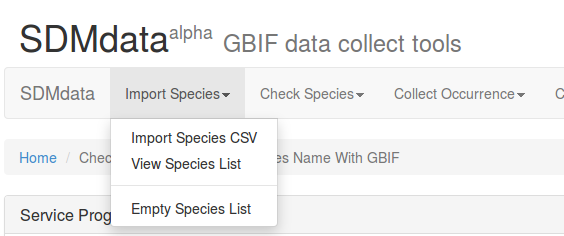
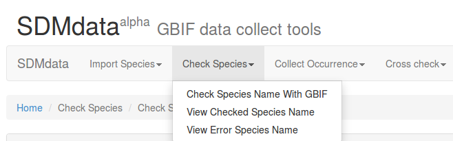
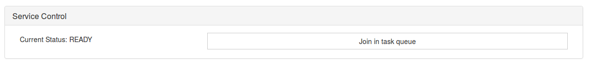
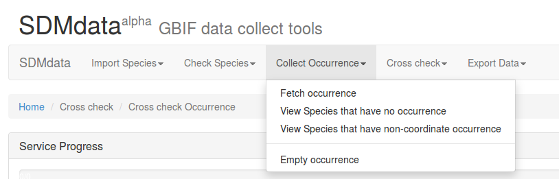
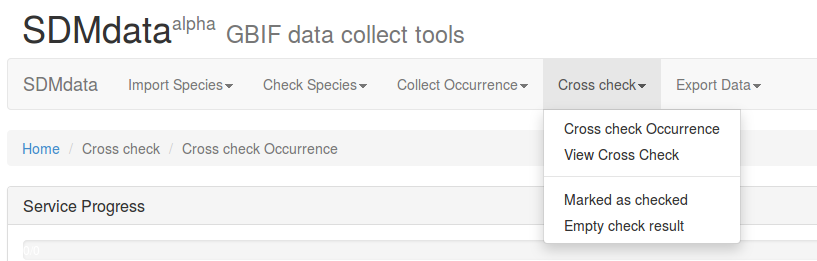
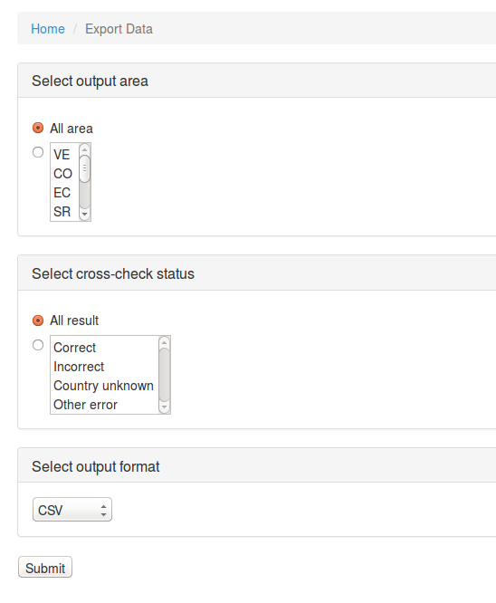

# Tutorial of SDMdata online
Work still in progress.

## Input species name list
### Species name list file
Species name list is a txt file which contains species name. Format is one species per line. For example:

    Anomaloglossus tepuyensis
    Arthroleptis variabilis
    Arthroleptis wahlbergii
    Atelopus carrikeri
    Atelopus andinus
    Atelopus oxyrhynchus
    Atelopus spumarius
    Atelopus pachydermus
    Atelopus spurrelli
    Austrochaperina basipalmata

User should notice that file encoding. This file must be encoded in ASCII fomat. Special character is not allowed. If it is wrong, please see faq.md.

### Upload to SDMdata
Interface screenshot:

## Check species name
Interface scrrenshot:

User need put the task in queue to execute it.
Interface screenshot:

## Collect occurrence data
Similar to check species name. Make sure that checking species name job has been done before doing this. Interface screenshot:

## Cross check
Similar to others. This an optional choice, user can jump it by "marked as checked". Interface screenshot:

## Export data
Interface screenshot:

